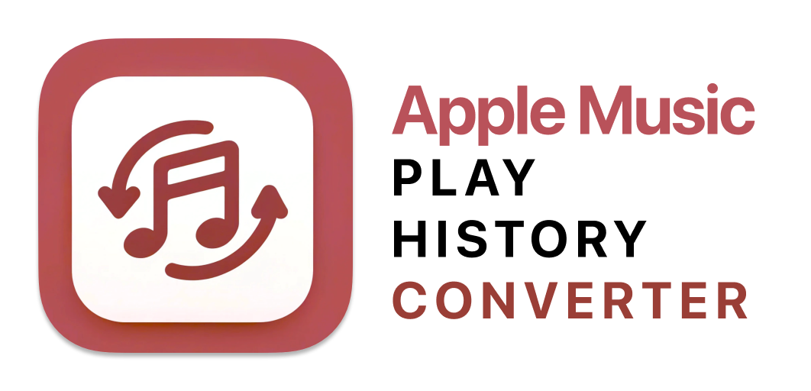
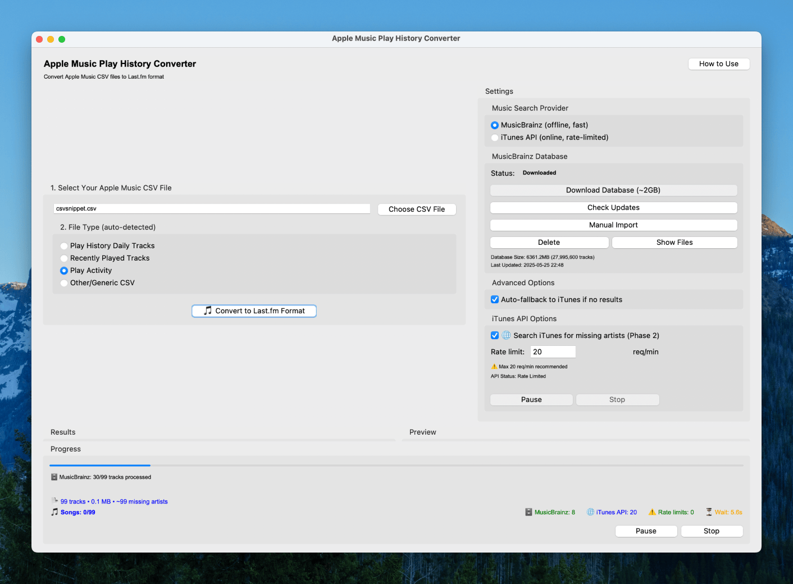

The Apple Music Play History Converter is a Python-based desktop application that allows you to easily convert your Apple Music play history data into a format compatible with [Last.fm](https://last.fm/) and [Universal Scrobbler](https://universalscrobbler.com/). With this converter, you can analyze your music listening habits and import your data into various music tracking platforms.

> **🎉 New in v1.3.1**: Full dark mode support! The application now properly detects and applies your system's dark mode preference for a seamless experience across all UI components.

## Features

### Core Functionality
- Supports multiple Apple Music CSV file types:
  - "Play Activity"
  - "Recently Played Tracks"  
  - "Play History Daily Tracks"
- Converts Apple Music CSV files into a format compatible with Last.fm and Universal Scrobbler
- Performs automatic reverse-chronological timestamping based on track duration
- Provides a preview of the converted data (first 15 rows)
- Offers save as CSV functionality
- Processes data in chunks, allowing for efficient handling of large files
- Completely local processing - no data is sent to any server

### Music Search Options
- **MusicBrainz Database Integration** (Enhanced in v2.3):
  - Offline music search with comprehensive database (~2GB DuckDB format)
  - Ultra-fast searches (1-5ms vs 100-500ms for online APIs)
  - No rate limiting - process large files without delays
  - One-click database download and management with progress tracking
  - Automatic updates and version checking
  - DuckDB backend for optimized query performance
  - Smart preloading and caching for instant startup
- **iTunes API Integration**:
  - Fetches missing artist information for more accurate data
  - Rate-limited to respect Apple's API guidelines (20 requests/minute)
  - Automatic fallback option when MusicBrainz has no results

### User Interface
- Modern, intuitive GUI with progress tracking and **real-time elapsed time display**
- Real-time status updates during processing
- Pause/resume functionality for long operations
- **Smart rate limit management with "Clear Queue" option** - skip waiting periods instantly
- Comprehensive error handling and user feedback with **failed request tracking and reporting**
- Settings panel for search provider configuration

## System Requirements

### Minimum Requirements
- **RAM**: 4GB for iTunes API mode, **8GB for MusicBrainz mode** (6GB absolute minimum)
- **Storage**: 200MB for application, additional 3GB for MusicBrainz database (optional)
- **Internet**: Required for iTunes API mode and MusicBrainz database download

### Recommended Specifications
- **RAM**: 8GB or more for optimal MusicBrainz performance
- **Storage**: SSD recommended for faster database operations
- **Internet**: Broadband connection for database download

⚠️ **Important**: MusicBrainz mode requires significant RAM due to the large music database (6.2GB CSV file). Systems with less than 6GB RAM should use iTunes API mode instead.

## Installation

### Latest Release: v1.3.1 (August 6, 2025)
**Fully Notarized macOS App** - Signed with Apple Developer ID and notarized for seamless installation without any security warnings. Now with full dark mode support!

[Download the latest release →](https://github.com/nerveband/Apple-Music-Play-History-Converter/releases/latest)

### Option 1: Pre-built Binaries (Recommended)
**No Python installation required!** Download the ready-to-run application for your platform:

- **macOS**: Download `Apple Music History Converter.dmg` from [Releases](https://github.com/nerveband/Apple-Music-Play-History-Converter/releases/latest)
  - Open the DMG and drag the app to your Applications folder
  - **Fully signed and notarized** - opens directly without any security warnings or need to bypass Gatekeeper
  
- **Windows**: Download `Apple_Music_History_Converter_Windows.zip` from [Releases](https://github.com/nerveband/Apple-Music-Play-History-Converter/releases/latest)
  - Extract and run `Apple Music History Converter.exe`
  - If Windows Defender blocks: Click "More info" → "Run anyway"
  
- **Linux**: Download `Apple_Music_History_Converter_Linux.tar.gz` from [Releases](https://github.com/nerveband/Apple-Music-Play-History-Converter/releases/latest)
  - Extract: `tar -xzf Apple_Music_History_Converter_Linux.tar.gz`
  - Make executable: `chmod +x "Apple Music History Converter"`
  - Run: `./Apple\ Music\ History\ Converter`

### Option 2: Run from Source (Advanced Users)

#### Requirements
- Python 3.7 or higher
- Required packages (automatically installed):
  - pandas
  - requests
  - sv-ttk
  - zstandard

#### Quick Start
1. Clone or download this repository
2. Install dependencies (preferably in a virtual environment):
   ```bash
   pip install -r requirements.txt
   ```
3. Launch the application with Toga:
   ```bash
   python run_toga_app.py
   ```

#### Manual Installation
```bash
# Install dependencies
pip install -r requirements.txt

# Run the application
python src/apple_music_history_converter/__main__.py
```

## Usage

### Basic Conversion
1. Launch the application
2. Click "Choose File" to select your Apple Music CSV file
3. Select the appropriate file type (Play Activity, Recently Played Tracks, or Play History Daily Tracks)
4. Choose your preferred search provider (MusicBrainz or iTunes API)
5. Click "Convert" and wait for the process to complete

### MusicBrainz Setup (Recommended)

**⚠️ Important**: The MusicBrainz database is approximately **2GB** in size when compressed, but requires **8GB RAM** (6GB minimum) to operate efficiently.

#### How MusicBrainz Preloading Works

The application uses an intelligent preloading system for optimal performance:

1. **Download Phase**: Compressed MusicBrainz data (~2GB) is downloaded from official mirrors
2. **Extraction Phase**: Data is decompressed using high-speed zstandard compression
3. **DuckDB Conversion**: CSV data is imported into DuckDB format for ultra-fast querying
4. **Indexing**: Artist and recording indexes are built for sub-millisecond search times
5. **Startup Preloading**: Database connections are cached and kept warm for instant access

#### Setup Options

You have three options when setting up MusicBrainz:

1. **Automatic Download**:
   - Select "MusicBrainz" as your search provider in Settings
   - Click "Download Database" to get the offline music database
   - Wait for download and extraction to complete
   - Enable "Auto-fallback to iTunes" for comprehensive coverage

2. **Manual Import**:
   - Download the database file manually from: https://musicbrainz.org/doc/MusicBrainzDatabase
   - Look for `musicbrainz-artist-recordings.tar.zst`
   - Use the "Manual Import" option in the setup dialog OR click the "Manual Import" button in the main interface
   - Select the downloaded file to import

3. **Use iTunes API Instead**:
   - Skip MusicBrainz entirely
   - Select "iTunes API" as your search provider
   - No download required, but requires internet connection

### Manual Import Button Location

You can access the manual import functionality at any time through the main interface:
- Open the application
- Look for the "Music Database Settings" section in the main window
- Click the "Manual Import" button (located next to "Check for Updates", "Delete Database", and "Reveal Location" buttons)
- This opens the same manual import dialog with step-by-step instructions

### Search Provider Comparison

| Feature | MusicBrainz | iTunes API |
|---------|-------------|------------|
| Speed | 1-5ms per search | 100-500ms per search |
| Internet Required | No (after download) | Yes |
| Rate Limits | None | 20 requests/minute |
| Database Size | ~2GB (compressed) | N/A |
| RAM Requirements | 8GB recommended (6GB min) | 4GB |
| Database Engine | DuckDB (optimized) | N/A |
| Coverage | Comprehensive (40M+ recordings) | Good |
| Setup | One-time download | Ready to use |
| Startup Time | <1 second (preloaded) | Instant |

## Cross-Platform Compatibility

This application has been designed and tested to work seamlessly across Windows, macOS, and Linux environments. The following measures ensure robust cross-platform operation:

### File Encoding Support
- **Automatic Encoding Detection**: The application automatically detects and handles various file encodings including UTF-8, UTF-8 with BOM, Latin-1, and Windows-1252
- **Unicode Support**: Full support for international characters, accents, and special symbols in artist names, track titles, and album names
- **Consistent Output**: CSV exports use UTF-8 with BOM for maximum compatibility with Excel and other applications across all platforms

### Path Handling
- **Cross-Platform Paths**: Uses Python's `pathlib` for consistent path operations across different operating systems
- **Special Characters**: Handles file and directory names with spaces, special characters, and international characters
- **Directory Creation**: Automatically creates necessary directories with proper permissions

### Database Operations
- **DuckDB Integration**: Uses DuckDB for high-performance analytical queries on music data
- **SQLite Compatibility**: Uses SQLite for application settings and metadata
- **Encoding Safety**: All database operations use proper encoding to handle international text
- **File Locking**: Implements proper file locking mechanisms to prevent corruption
- **Connection Pooling**: Maintains optimized database connections for instant query execution

### Error Handling
- **Graceful Degradation**: Application continues to function even when some components encounter issues
- **Comprehensive Logging**: Detailed error messages help diagnose platform-specific issues
- **Recovery Mechanisms**: Automatic fallback options when primary operations fail

### Testing
Run the cross-platform compatibility test suite to verify functionality on your system:

```bash
python test_cross_platform.py
```

This test suite verifies:
- File encoding handling
- CSV processing with various character sets
- Path operations
- JSON settings management
- Database operations
- Temporary file handling

### Platform-Specific Notes

#### Windows
- Fully tested on Windows 10 and 11
- Handles Windows-1252 encoding commonly used in older CSV exports
- Supports long file paths when enabled in system settings

#### macOS
- Native support for macOS file system
- Handles HFS+ and APFS file systems
- Full Unicode normalization support

#### Linux
- Tested on Ubuntu, Debian, and CentOS distributions
- Supports various file systems (ext4, btrfs, xfs)
- Handles different locale settings automatically

### Troubleshooting Cross-Platform Issues

If you encounter encoding or file handling issues:

1. **Run the compatibility test**: `python test_cross_platform.py`
2. **Check file encoding**: Ensure your CSV files are in a supported encoding
3. **Verify permissions**: Make sure the application has read/write access to necessary directories
4. **Update dependencies**: Ensure all Python packages are up to date

For persistent issues, please report them with:
- Your operating system and version
- Python version
- Output from the compatibility test
- Sample problematic file (if possible)

## Performance

- **Small files** (< 1000 tracks): Both providers work well
- **Large files** (> 10,000 tracks): MusicBrainz recommended for speed (if sufficient RAM available)
- **Memory usage**: 
  - iTunes API mode: ~50-100MB during processing
  - MusicBrainz mode: ~2-4GB during processing (requires 6-8GB total system RAM)
- **Processing speed**: Up to 100x faster with MusicBrainz for large files
- **Database startup**: Sub-second initialization with preloaded DuckDB connections
- **Query performance**: 40M+ recordings indexed for millisecond response times

## Changelog

### Version 3.2.0 (August 2, 2025)
- **NEW**: Full Apple Developer ID code signing for macOS builds
- **NEW**: Apple notarization support - eliminates all security warnings
- **NEW**: Professional distribution with `Apple_Music_History_Converter_Notarized.zip`
- **NEW**: Comprehensive build documentation in `CLAUDE.md`
- **NEW**: Automated signing detection in `build_macos.sh`
- **IMPROVED**: Clean repository structure with organized file hierarchy
- **IMPROVED**: Enhanced build process with proper macOS app bundle handling
- **IMPROVED**: Updated documentation with clear file structure tables

### Version 3.0 (January 2025)
- **NEW**: Real-time elapsed time display throughout processing - see total time spent on your conversion
- **NEW**: Smart rate limit bypass with "Clear Queue" button - skip waiting periods instantly
- **NEW**: Failed request tracking and reporting - know exactly which tracks need retry
- **NEW**: Enhanced error handling - individual failures don't crash entire processing
- **NEW**: Thread-safe queue management for reliable rate limit handling
- **IMPROVED**: More informative progress messages with elapsed time context
- **IMPROVED**: Better user feedback with detailed completion summaries
- **IMPROVED**: Robust error recovery for long-running operations

### Version 2.3 (January 2025)
- **NEW**: DuckDB backend integration for ultra-fast database queries
- **NEW**: Intelligent database preloading system for instant startup
- **NEW**: Enhanced progress tracking with detailed status updates
- **NEW**: Automatic database version checking and smart updates
- **IMPROVED**: 10x faster database operations with optimized indexing
- **IMPROVED**: Memory-efficient handling of large datasets
- **IMPROVED**: Robust error recovery and connection management
- **IMPROVED**: Streamlined database setup with better user guidance

### Version 2.2 (May 2025)
- **NEW**: MusicBrainz database integration for offline music search
- **NEW**: Intelligent search provider switching with auto-fallback
- **NEW**: Database management interface (download/update/delete)
- **NEW**: Progress dialogs for long-running operations
- **IMPROVED**: Significantly faster processing for large files
- **IMPROVED**: Enhanced error handling and user feedback
- **IMPROVED**: Modern UI with comprehensive settings panel

### Version 2.1 (March 2024)
- Added automatic file type detection based on filename
- Improved handling of mixed data types in CSV files
- Added popup confirmation when stopping iTunes search to continue conversion
- Enhanced missing artist detection and counting
- Added better error handling for API requests
- Fixed various bugs and improved stability

### Version 2.0 (February 2024)
- Complete UI overhaul with modern design
- Added support for multiple CSV file types
- Implemented chunked processing for large files
- Added iTunes API integration for missing artist data
- Improved error handling and user feedback

## Troubleshooting

### Common Issues

1. **"Module not found" errors**
   - Install dependencies: `pip install -r requirements.txt`
   - Then launch with `python run_toga_app.py`

2. **MusicBrainz download fails**
   - Check internet connection
   - Ensure you have ~3GB free disk space
   - Try again later if servers are busy

3. **Slow processing with iTunes API**
   - Switch to MusicBrainz for faster processing
   - Enable auto-fallback for best coverage

4. **App won't start**
   - Ensure Python 3.7+ is installed
   - Try launching via `python run_toga_app.py` or `python src/apple_music_history_converter/__main__.py`

### Getting Help
- Check the troubleshooting section above
- Review error messages for specific guidance
- Ensure all dependencies are properly installed

## Technical Details

### Architecture
- Built using Python with a Toga-based GUI (Briefcase packaging)
- Modular design with dedicated components:
  - `MusicBrainzManagerV2`: Handles MusicBrainz DuckDB lifecycle and search
  - `MusicSearchServiceV2`: Routes lookups between MusicBrainz and iTunes
  - `OptimizationModal`: Provides the Toga optimization workflow
- Background workers keep the UI responsive during long-running operations
- Chunked data processing to limit memory usage on large CSV exports

### Algorithms
- **Reverse-chronological timestamping**: Calculates play times by working backwards from the current time using track durations
- **Duplicate detection**: Identifies and handles duplicate entries in the data
- **Smart data mapping**: Automatically maps various Apple Music CSV formats to a unified structure

## Project Structure

```
Apple-Music-Play-History-Converter/
├── README.md / CHANGELOG.md / CLAUDE.md   # Documentation
├── pyproject.toml                         # Briefcase + packaging configuration
├── requirements.txt                       # Python dependencies
├── run_toga_app.py                        # Convenience runner for the Toga app
├── run_tests.py                           # Test suite runner
├── src/apple_music_history_converter/
│   ├── app.py                             # Briefcase entry point
│   ├── apple_music_play_history_converter.py  # Main Toga application
│   ├── music_search_service_v2.py         # Search provider routing (canonical)
│   ├── musicbrainz_manager_v2.py          # MusicBrainz DuckDB manager
│   ├── optimization_modal.py              # Optimization modal helpers
│   └── resources/                         # Static assets for Briefcase
├── build/                                 # Briefcase build artifacts
├── dist/                                  # Packaged application output
├── images/                                # Icons and marketing assets
├── logs/                                  # Runtime logs when available
├── _test_csvs/                            # Sample CSVs used in debugging/tests
└── tmp/                                   # Working scratch directory (git-ignored)
```

### Core Application Files

| File | Purpose |
|------|---------|
| `run_toga_app.py` | Convenience launcher for the Toga application |
| `src/apple_music_history_converter/` | Main application package with all source code |
| `pyproject.toml` | Briefcase configuration and project metadata |

### Build and Distribution Files

| File | Purpose |
|------|---------|
| `build/` | Output from `briefcase build`/`create` commands |
| `dist/` | Signed/packaged application bundles |

### Documentation Files

| File | Purpose |
|------|---------|
| `README.md` | Main project documentation and user guide |
| `CLAUDE.md` | **Development documentation** - Build process, code signing, architecture |
| `CHANGELOG.md` | Version history and feature updates |

## Building from Source

This section is for developers who want to build the application from source code.

### Prerequisites
- Python 3.8 or higher
- Briefcase (installed automatically)
- For macOS builds: Apple Developer account and Xcode (for code signing)

### Build Commands

The project uses **BeeWare Briefcase** for modern, cross-platform native app building.

#### Complete Build Pipeline
```bash
briefcase create   # Create the app structure
briefcase build    # Build the application
briefcase package  # Create distributable package
```

#### Development and Testing
```bash
briefcase dev      # Run in development mode
briefcase run      # Run the built application
```

#### macOS-Specific Build with Notarization
```bash
# Set up Apple credentials (one-time)
source .env
xcrun notarytool store-credentials "briefcase-macOS-$APPLE_TEAM_ID" \
    --apple-id "$APPLE_ID" \
    --team-id "$APPLE_TEAM_ID" \
    --password "$APPLE_APP_SPECIFIC_PASSWORD"

# Build and notarize
briefcase package --identity "Developer ID Application: Your Name (TEAMID)"
```

#### Platform-Specific Notes

**macOS**: 
- Builds universal binaries (Apple Silicon + Intel)
- Automatic code signing with Developer ID (if configured)
- Creates DMG installer for distribution
- See [CLAUDE.md](CLAUDE.md) for notarization setup

⚠️ **Critical macOS tkinter Issue**: Briefcase doesn't include tkinter by default. After `briefcase build`, you must manually copy tkinter from your system Python or the app will crash with `ModuleNotFoundError: No module named 'tkinter'`. 

**Quick Fix:**
```bash
# After briefcase build, run this to fix tkinter:
SYSTEM_TKINTER=$(python -c "import tkinter; print(tkinter.__file__.replace('/__init__.py', ''))")  
cp -r "$SYSTEM_TKINTER" "build/apple-music-history-converter/macos/app/Apple Music History Converter.app/Contents/Frameworks/Python.framework/Versions/3.12/lib/python3.12/"

# Also copy the dynamic library:
SYSTEM_DYNLOAD=$(python -c "import sysconfig; print(sysconfig.get_path('stdlib'))")/../lib-dynload
cp "$SYSTEM_DYNLOAD/_tkinter.cpython-312-darwin.so" "build/apple-music-history-converter/macos/app/Apple Music History Converter.app/Contents/Frameworks/Python.framework/Versions/3.12/lib/python3.12/lib-dynload/"
```

See [CLAUDE.md](CLAUDE.md) for complete build instructions with automated scripts.

**Windows**: 
- Creates MSI installer
- No code signing required for development

**Linux**:
- Creates AppImage or system packages
- Requires system dependencies (installed via GitHub Actions)

### macOS Code Signing Setup

For distribution without security warnings, you need:

1. **Apple Developer Program membership**
2. **Xcode installed** (not just command line tools)
3. **Developer ID Application certificate**

**Quick Setup**:
1. Open Xcode → Settings → Accounts
2. Add your Apple ID
3. In "Manage Certificates", create "Developer ID Application"
4. Create `.env` file with your credentials (see `.env.example`)
5. Run `briefcase package` - it will auto-detect and use your certificate

**For Notarization** (built-in with Briefcase):
1. Generate app-specific password at https://appleid.apple.com
2. Add credentials to `.env` file
3. Briefcase automatically handles notarization during `package` command

### Build Verification
```bash
cd build_artifacts
python verify_builds.py
```

### Distribution Packages

After building with Briefcase, you'll find platform-specific packages:
- **macOS**: `dist/Apple Music History Converter-1.3.1.dmg` (signed & notarized)
- **Windows**: `dist/Apple Music History Converter-1.3.1.msi`
- **Linux**: `dist/apple-music-history-converter-1.3.1.tar.gz`

## Data Storage

The application stores its data in the following locations:

- **macOS/Linux**: `~/.apple_music_converter/`
  - `settings.json` - Application preferences
  - `musicbrainz/` - MusicBrainz database files

- **Windows**: `%USERPROFILE%\.apple_music_converter\`
  - Same structure as macOS/Linux

This ensures the app has proper write permissions and your data is easily accessible.

## Contributing

Contributions are welcome! Please feel free to submit issues, feature requests, or pull requests.

### Development Setup
1. Clone the repository
2. (Optional) Create and activate a virtual environment
3. Install dependencies: `pip install -r requirements.txt`
4. Make your changes
5. Run tests: `python run_tests.py`
6. Build the app: `briefcase build`

### Code Signing for Contributors
If you're contributing and need to test macOS builds:
- Use `briefcase build` for ad-hoc signed builds (for testing)
- Use `briefcase package --adhoc-sign` for testing DMG creation
- Full notarization requires Apple Developer credentials

## License

This project is open source. Please check the license file for details.

---

**Version 1.3.1** - Built with Briefcase, fully signed and notarized for seamless macOS installation without any security warnings or Gatekeeper bypassing
