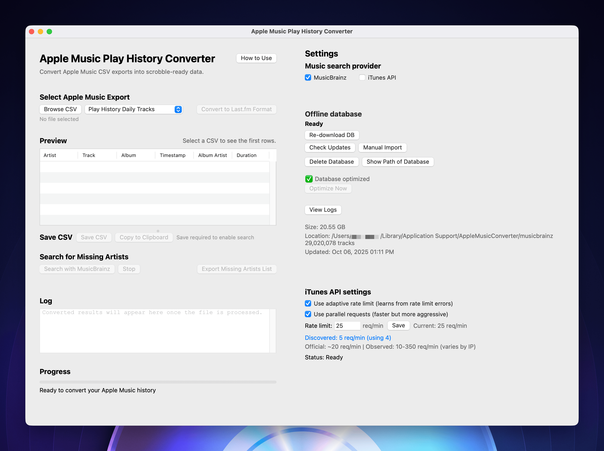

# Apple Music Play History Converter




A modern desktop application that converts Apple Music play history CSV files into Last.fm and Universal Scrobbler compatible format.

> **🚀 New in v2.0.0-beta**: Complete rewrite with Toga framework! Ultra-fast batch processing, parallel iTunes search, and fully responsive async UI. **This is a beta release** - please report any issues on GitHub. [See what's new →](#whats-new-in-v20)

## Features

- **Multi-Format Support**: Works with "Play Activity", "Recently Played Tracks", and "Play History Daily Tracks" CSV files
- **Dual Search Providers**:
  - **MusicBrainz**: Offline database (~2GB) with 10,000+ tracks/sec search speed
  - **iTunes API**: Online fallback with 10 parallel workers and adaptive rate limiting
- **Ultra-Fast Processing**: Batch processing handles large files 100x faster than previous versions
- **Live Progress Tracking**: Real-time updates showing exactly what's happening during searches
- **Smart Auto-Save**: Automatic checkpoints every 50 tracks protect your progress
- **Rate-Limited Track Management**: Separate retry and export system for iTunes 403 rate limit errors
  - Retry button for tracks that hit rate limits
  - Export rate-limited tracks to CSV for manual review
  - Smart separation of temporary (rate-limited) vs permanent failures
- **Cross-Platform**: Native apps for Windows, macOS, and Linux
- **100% Local Processing**: Your music data never leaves your computer

## Quick Start

### Download & Install

**No Python required!** Download the ready-to-run app for your platform:

#### 🍎 macOS (Universal Binary)
**[⬇️ Download Apple Music History Converter-2.0.0-beta.dmg](https://github.com/nerveband/Apple-Music-Play-History-Converter/releases/latest)**

✅ **Fully signed and notarized** by Apple Developer ID
✅ **No security warnings** - opens immediately
✅ **Works on Apple Silicon (M1/M2/M3) and Intel Macs**

**Installation:**
1. Download the DMG file
2. Open the DMG and drag the app to your Applications folder
3. Double-click to run - no configuration needed!

---

#### 🪟 Windows (MSI Installer)
**[⬇️ Download Apple-Music-History-Converter-2.0.0-beta.msi](https://github.com/nerveband/Apple-Music-Play-History-Converter/releases/latest)**

✅ **Professional MSI installer**
✅ **No Python installation required**
✅ **Works on Windows 10 and Windows 11**

**Installation:**
1. Download the MSI file
2. Double-click to install
3. App appears in Start Menu → "Apple Music History Converter"

---

#### 🐧 Linux (Compile from Source)
**⚠️ No pre-built binaries available** - Linux users must compile from source

**Installation:**
```bash
git clone https://github.com/nerveband/Apple-Music-Play-History-Converter.git
cd Apple-Music-Play-History-Converter
pip install -r requirements.txt
python run_toga_app.py
```

**Requirements:**
- Python 3.12+
- GTK 3 development libraries
- See [Linux Build Guide](../../wiki/Linux-Installation) for distribution-specific instructions

### Run from Source

```bash
git clone https://github.com/nerveband/Apple-Music-Play-History-Converter.git
cd Apple-Music-Play-History-Converter
pip install -r requirements.txt
python run_toga_app.py
```

## Usage

1. **Select your CSV file** from Apple Music
2. **Choose search provider**:
   - MusicBrainz (recommended for large files, requires 2GB database download)
   - iTunes API (slower but works immediately)
3. **Click "Search for Missing Artists"** to find missing artist information
4. **Save** the converted CSV file for Last.fm or Universal Scrobbler

## What's New in v2.0-beta

### ⚠️ Beta Release Notice
This is a beta release of the complete UI rewrite. While extensively tested (44/44 tests passing), please report any issues you encounter on GitHub.

### 🚀 Major Improvements

- **100x Faster**: Batch processing with DuckDB replaces old row-by-row searches
- **Parallel iTunes Search**: 10 concurrent workers with smart rate limiting
- **Live Updates**: See results as they arrive, not after everything completes
- **Never Freezes**: Fully async UI stays responsive during processing
- **Auto-Save**: Progress automatically saved every 50 tracks
- **Better Architecture**: Clean separation of UI and processing threads

### 🔧 Technical Changes

- **Toga Framework**: Modern cross-platform native UI (replaces tkinter)
- **Thread-Safe**: Proper async/await patterns with background task management
- **DuckDB Backend**: Optimized MusicBrainz queries with vectorized pandas operations
- **Code Quality**: Removed 1,051 lines of dead code and legacy methods

[See full changelog →](CHANGELOG.md)

## Documentation

- [Installation Guide](../../wiki/Installation)
- [User Guide](../../wiki/User-Guide)
- [MusicBrainz Database Setup](../../wiki/MusicBrainz-Database)
- [Building from Source](../../wiki/Building-from-Source)
- [Development Guide](../../wiki/Development)
- [Troubleshooting](../../wiki/Troubleshooting)

## System Requirements

### Minimum
- **RAM**: 4GB (iTunes API) or 8GB (MusicBrainz)
- **Storage**: 200MB app + 3GB for MusicBrainz database (optional)
- **OS**: macOS 10.13+, Windows 10+, or modern Linux

### Recommended
- **RAM**: 8GB or more
- **Storage**: SSD for faster database operations
- **Internet**: Broadband for database download

## Support

- **Issues**: [GitHub Issues](https://github.com/nerveband/Apple-Music-Play-History-Converter/issues)
- **Wiki**: [Documentation](../../wiki)
- **Releases**: [Download Page](https://github.com/nerveband/Apple-Music-Play-History-Converter/releases)

## License

MIT License - see [LICENSE](LICENSE) file for details

## Credits

Built with [BeeWare Toga](https://beeware.org/) • [Pandas](https://pandas.pydata.org/) • [DuckDB](https://duckdb.org/)

---

**Version 2.0.0-beta** | [Changelog](CHANGELOG.md) | [Wiki](../../wiki) | [Report Issue](https://github.com/nerveband/Apple-Music-Play-History-Converter/issues)
