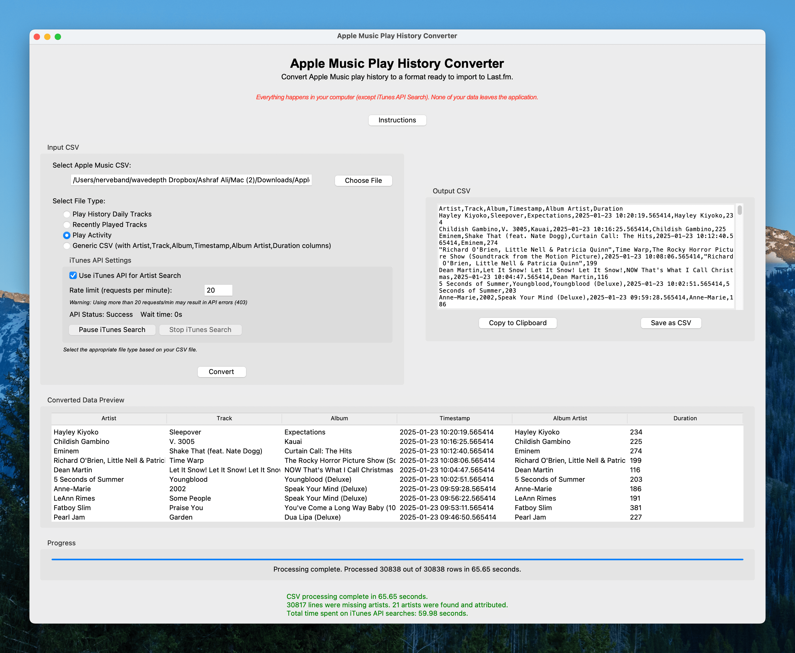

The Apple Music Play History Converter is a Python-based desktop application that allows you to easily convert your Apple Music play history data into a format compatible with [Last.fm](https://last.fm/) and [Universal Scrobbler](https://universalscrobbler.com/). With this converter, you can analyze your music listening habits and import your data into various music tracking platforms.

## Features

- Supports multiple Apple Music CSV file types:
  - "Play Activity"
  - "Recently Played Tracks"
  - "Play History Daily Tracks"
- Converts Apple Music CSV files into a format compatible with Last.fm and Universal Scrobbler
- Performs automatic reverse-chronological timestamping based on track duration
- Utilizes the iTunes API to fetch missing artist information for more accurate data (optional)
- Provides a preview of the converted data (first 15 rows)
- Offers save as CSV functionality
- Processes data in chunks, allowing for efficient handling of large files
- Completely local processing - no data is sent to any server

## Changelog

### Version 2.1 (March 2024)
- Added automatic file type detection based on filename
- Improved handling of mixed data types in CSV files
- Added popup confirmation when stopping iTunes search to continue conversion
- Enhanced missing artist detection and counting
- Added better error handling for API requests
- Fixed various bugs and improved stability

### Version 2.0 (February 2024)
- Complete rewrite with new GUI using Tkinter
- Added support for all Apple Music CSV formats
- Added iTunes API integration for missing artist lookup
- Added progress tracking and preview functionality
- Added pause/resume functionality for API requests
- Improved error handling and user feedback

## Technologies Used

- Python
- Tkinter (for GUI)
- Pandas (for data processing)
- Requests (for iTunes API calls)

## Usage

1. Request your full Apple Music listening history from [privacy.apple.com](https://privacy.apple.com/).
2. Extract the downloaded ZIP archive and locate the relevant CSV files.
3. Run the Python script or the precompiled Mac app.
4. Click "Choose File" to select the Apple Music CSV file you want to convert.
5. Select the appropriate file type (Play Activity, Recently Played Tracks, or Play History Daily Tracks).
6. Enable/disable iTunes API checking for missing artist information (optional).
7. Click the "Convert" button and wait for the conversion process to complete.

The converter will process the file and save the converted data as a new CSV file. You can view a preview of the converted data by clicking the "Show Preview" button.

## Performance

- The converter can process large files efficiently. For example, it takes approximately 24 seconds to load and process a 200MB file.

## Additional Features

- Progress bar to track conversion progress
- Ability to pause/resume iTunes API searches during conversion
- Instructions available within the application
- File size and row count information displayed before conversion

## Installation

### Option 1: Run the Python Script

1. Ensure you have Python 3.x installed on your system.
2. Install the required packages:
   ```
   pip install -r requirements.txt
   ```
3. Run the script:
   ```
   python apple_music_converter.py
   ```

### Option 2: Use the Precompiled Mac App

1. Download the precompiled Mac app from the dist folder.
2. Double-click the app to run it.

## Contributing

Contributions to the Apple Music Play History Converter are welcome! If you have any ideas, suggestions, or bug reports, please open an issue or submit a pull request on the GitHub repository.

## Contact

If you have any questions or just want to say hi, feel free to reach out to me at hello@ashrafali.net. You can also find more of my work at [https://ashrafali.net](https://ashrafali.net).

Happy converting!

With optimism,
Ashraf
